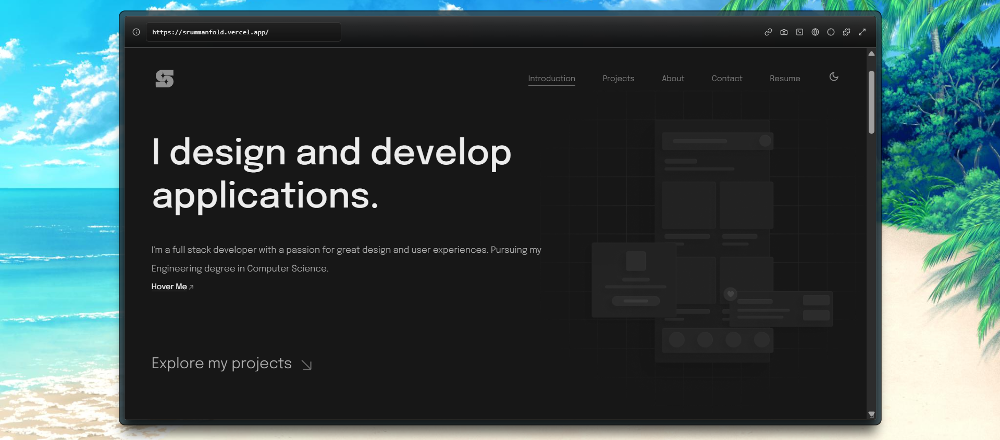

- **Framework**: [Next.js](https://nextjs.org/)
- **Deployment**: [Vercel](https://vercel.com)
- **Styling**: [Tailwind CSS](https://tailwindcss.com/)
- **Animation**: [Framer Motion](https://www.framer.com/motion/)

---

# Shaikh Rumman Fardeen

### ***This portfolio website was utilized during my time in college as part of my learning and exploration of web development.***

***Disclaimer : This is not an original project of mine. I discovered it some years ago on GitHub while learning web development and made several customizations to understand how things work. Unfortunately, I can no longer trace the original author—so I do not claim ownership of the project, only the modifications I've made.***

---

## Features

* **Responsive Design** : Adapts seamlessly to desktop, tablet, and mobile screen sizes.
* **Project Showcase** : Gallery or card layout to present development work with images, descriptions, and links.
* **About Section** : Highlights background, skills, and experience.

---

## Technologies

| Layer    | Technologies   |
| -------- | -------------- |
| Frontend | React, Next.js |
| Styling  | Tailwind CSS   |
| Hosting  | Vercel         |

---

## Installation

 **Prerequisites** :

* [Node.js](https://nodejs.org/en/) v14 or newer
* [npm](https://www.npmjs.com/) or [yarn](https://yarnpkg.com/)

 **Clone the repository** :

```bash
git clone https://github.com/srummanf/Portfolio-v2.git
cd Portfolio-v2
```

 **Install dependencies** :

```bash
npm install
# or
yarn install
```

---

## Usage

 **Run locally** :

```bash
npm run dev
# or
yarn dev
```

Open [http://localhost:3000](http://localhost:3000/) to view in browser.

 **Build for production** :

```bash
npm run build
npm start
# or
yarn build
yarn start
```

---

## Customization

You're a developer—you know the vibe. Crack open the folder, tweak components, rewrite content, and toss in your projects. Update styles to match your brand, adjust metadata for SEO, and refactor anything that doesn’t spark joy. This portfolio is your canvas—customize it however you like.

---

## Contributing

Contributions are welcome. To propose improvements:

1. Fork the repository.
2. Create a feature branch: `git checkout -b feature/YourFeature`.
3. Commit your changes and push: `git push origin feature/YourFeature`.
4. Open a pull request describing your changes.

Please ensure code formatting and linting are consistent.

---

# Once Again:

***Disclaimer** : This is not an original project of mine. I discovered it some time ago on GitHub while learning web development and made several customizations to understand how things work. Unfortunately, I can no longer trace the original author—so I do not claim ownership of the project, only the modifications I've made.*

---

# A Great and Minimalistic Black Theme Based Professional Portfolio Template

---


<table>
  <tr>
    <td align="left" width="50%">
      <strong>By</strong><br />
      Shaikh Rumman Fardeen<br />
      <a href="https://github.com/srummanf">GitHub: @srummanf</a><br />
      <a href="mailto:rummanfardeen4567@gmail.com">rummanfardeen4567@gmail.com</a>
    </td>
  </tr>
</table>
